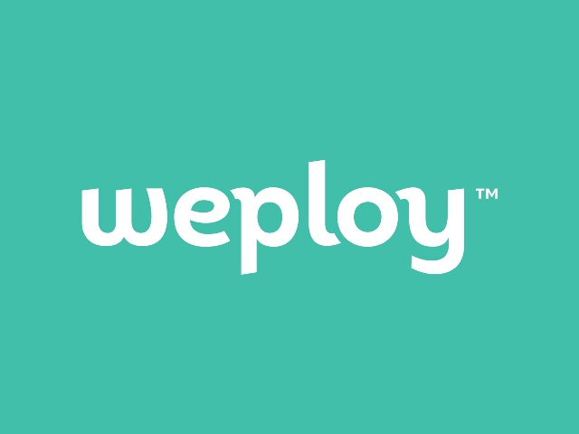
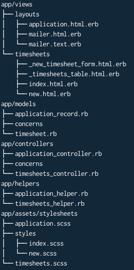
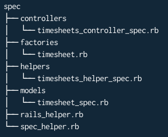
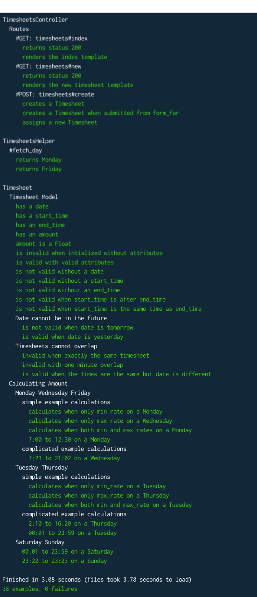
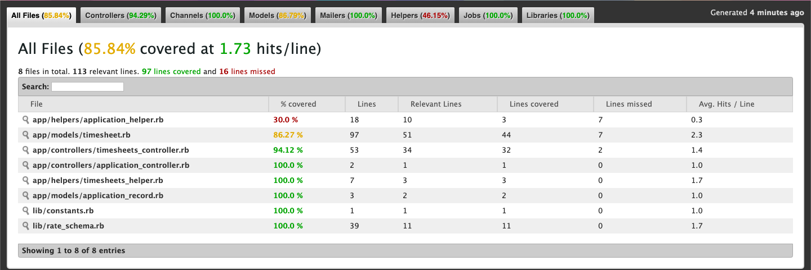

# Timesheets - 2019 Weploy Coding Test


## About
This is my attempt at Weploy's 2019 backend technical challenge,

## Setup

To download this application to your computer, navigate to the directory you want to use on your computer and run the following:
```
git clone https://github.com/JoshTeperman/weploy-timesheets.git
```
This should install the files locally. You can then run `cd weploy-timesheets` to open the application directory. 

Alternatively, you can download the code directly to your hard-drive: https://github.com/JoshTeperman/weploy-timesheets/archive/master.zip
To run this application, you will first need to have Ruby 2.6.0 installed on your machine. 

Installation instructions here: https://www.ruby-lang.org/en/documentation/installation/

You will also need Bundler installed:
```
gem install bundler
```
Once you have Ruby + Bundler installed, you can install the gem dependencies with this command:
```
bundle install
```

Once the gems are installed you need to set up the local database on your machine. Run these three commands:
```
rails db:create
rails db:migrate
rails db:seed
``` 
Once you've done that you should be able to run `rails s` to start the local server and visit http://localhost:3000/ to view a live version of the application.

To run the test suite and see if anything is failing run `bundle exec rspec` and you should see every test and a summary of the results of the tests. 

To view a test-coverage summary of the coverage of the tests you can run `open coverage/index.html` from console which will open a tab in your default browser and display test coverage information.

# App Description 

### Tech Stack
Since the challenge specifically stated the application had to be written in Ruby I decided to create a Rails application. Therefore my tech stack is Ruby, Embedded Ruby, HTML and CSS/SASS.

### Architecture 
I followed the Rails standard MVC Architecture. Modularized code separated into Models, Views and Controllers. 

>Front End
The front end Views are created using Embedded Ruby served with data from the backend and styled with CSS and very small amounts of SASS. 

>Back End
My app uses the default Rails server, with Rails Routes and Controllers handling the business logic and responding to HTTP requests. 
There is only one Model, `Timesheet`, which is defined in the Models directory, and Timesheet data is stored in a PostgresQL Database accessed using Active Record. 

## Functionality (Front End): 
The front end of this application is very simple. A user visiting the webstie can only do two things:
- Create New Timesheets
- View Timesheets

Any errors from the backend are displayed as flash messages that the user can click to close.

Successfully creating a Timesheet redirects the user to the index page where they see a success flash message.

## Functionality (Back End): 
The backend creates new Timesheets and serves Timesheet data to the frontend in response to to HTTP requests.

New Timesheets are using Rails hard parameters and additional custom validation functions. The code confirms that:
- they contain each of the required attributes 'date', 'start_time', 'end_time'
- they don't overlap
- they are in the past
- their start time is before their end time

Any errors raised by these validations are captured and sent to the front end so they can be seen by the user.

When a timesheet is created the salary amount is calculated dynamically by a callback function, down to the minute.

New salary schema can flexibly be created and assigned to specifica days so that timesheet amounts are automatically calculated based on the day of the week, and whether or not the hours were normal hours, overtime hours, or both. 

### File Structure



## Solution / Key Decisions

### Structure / Modularization
focus on modularising / separation of concerns / configuring
... with the assumption that this would be expanded upon 
- Constants
- Additional RateSchema class to allow for flexibly managing different rates for different days 
- Using Timesheet Helper
- Factory Bot
- Refactoring 

### Rubocop 
Variable naming
-> felt it was difficult to undertand what was going on without some descriptive naming
-> wasn't sure what to do about some methods that were long or had too many branches according to Rubocop

### Bootstrap
Installed the gem, used it for flash messages so they can be closed, rather than using the rails guides syntax for displaying error messages on screen. 
- Not a great idea to install gems just for small use case, must be a better option as I'm not using Bootstrap or JQuery for anything else.

### Managing Rates
Backend functionality created so that new Rate Schema can be created as an instance of RateSchema class, and then assigned days of the week.  can be 

.. Could also conceivably be assigned to days of the year / specific dates using additional control flow eg:
```
rate_schema = christmas_rate if christmas?
```

## Amount Calculation
Solving Amount calculation 
Attempt 1: 

Attempt 2:
Intersection

For example Mon, Wed, Fri
Between 7am and 7pm, rate is $22 / hour
Otherwise, the rate is $33 / hour

If we think of our timesheet start_time and end_time as a Set of numbers, where each number is a unit of time in the range (12:00..11:59)
`day = Set.new( [(12:00..11:59)] )`
If we think of the max-rate range as another set:
`min_rate_set = Set.new( [(7:00..19:00)] )`
max_rate_set = day - max_rate

Then we we have a new Timesheet:
`timesheet = Set.new( timesheet_range )`
... we can check the overlapping sections of that timesheet with our max_rate and min_rate ranges:
min_overlap = timesheet.intersection(min_rate_set)

... and return the the salary value for each range:

total_min = min_overlap.length * min_rate
total_max = max_overlap.length * max_rate

total_timesheet_amount = total_min + total_max

pros: 
Don't have to worry about decision trees or control flow to check whether a timesheet should be calculated using min_rate, max_rate, or both. Just compare the timesheet with the relavent set and return the overlapping units of time * relavent rate.
Less code.
Should be fairly fast - Set's provide the useability of arrays with the speed gains of hashes

cons:
A little more obscure, not as easy to understand what's going on at first glance
Not sure of the performance cost of rang -> array -> set conversion, Set class methods (.length on a Set, for example)

Rate class with base_rate and overtime_rate works fairly well for base/overtime pairs, but would need to be reconfigured should there be more than two rates for a given day.
Also works fairly well assuming that rates are configured based on weekday. You could theoretically create a new rule for a one-off day (ie a holiday / Christmas etc) by saying if timesheet.date = '2019/12/26' then rate = Rate.new().

https://tosbourn.com/set-intersection-in-ruby/

# Testing
I decided to use Rspec with rails-controller-testing and spent some additional time learning to use Factory Bot to make life easier and reduce code repetition. I also installed simplecov to analyse test converage.

There are currently 38 tests, all passing. Test coverage is 85% which I'm very comfortable with as my application_helper.rb score of 30% is what's bringing the number down and that's just a bit of code that spits out flash messages using bootstrap.  

I wrote quite a lot of tests for Timesheet model validation and the logic used to calculate timesheet amount, just as I was pretty worried that calculation would failr for timesheets with unusual start-times and end-times, and calculations that had to consider multiple hourly rates. 

I wasn't sure how far I should go using FactoryBot and let(:) blocks to mock resources and variables in my tests. I chose to use FactoryBot to mock timesheets because it made it much easier to create instances of Time and Date classes and I could remove a lot of repeated code. 

To test the logic used to calculate timesheet amounts however, I had the option of simply using the RateSchema Class instances predefined in my code. However I chose not to do so and hard coded those calculations to determine what the expected total should be and compared that with the timesheet.amount attribute generated by my code. 

There were two reasons I chose this strategy. The first most important reason was that the logic itself is all private methods that are triggered with a :before_create hook, so difficult to reach with tests. The other reason was that I was concerned that pulling the same classes directly from the code I wanted to test would also risk pulling any bugs into my tests and not make the tests fail. I wanted to test the *result* of my code, ie: the amount itself, rather than how the amount is calculated. I wanted to test let my actual code produce results that I could test. I thought this would help me test the code itself rather than risk false positives from errors being replicated in my tests. However at the same time It led to a lot of additional repeated code, and changing constants like RateSchema instances would require a lot of changes in my tests as well. 

The downside of this strategy is that any test will have to be completely rewritten if the RateSchema themselves change, and there was a greater chance of human error in writing the calculations in the tests that calculate the expected answer, so extra care had to be taken. 


> Test File Structure 



> Test Suite



> Test Coverage



# Assumptions:

- Timesheets always start and end on the same day.
- '7am - 7pm' is inclusive, therefore a Monday timesheet starting at 7:00am and finishing at 7:00pm will include both the 7:00am minute and teh 7:00pm minute at the minimum rate
- Time Zones are set to Melbourne for the purposes of this app.
- The server will always be available, as will the internet connecction.
- The New Timesheet Form will always result in a POST request that attempts to create a model with the expected datatypes, except in cases where a field may be left blank.
- A user is authorized to view any endpoint and access any controller method.


# Extending the Application

>Tests
- more details tests for the views, ensuring they render correctly, ensuring timesheets are added when a new one is created
- testing some more of the unhappy paths - particularly error handling and displaying flash messages 
>Functionality
- CRUD functionality - edit, upload, delete, show (single timesheet)
- user login and authentiction, users sessions and possibly cookies: would probably go with Devise and cancan or something similar
- make forma data persist when model validations fail and throw an errow so users don't have to resubmit their data
- client-side rendering (eg with React) to update the views without refreshing the entire page
- allow for overlapping days (should be able to start at 11pm and finish at 1am the next day, for example)
- allow users to select their timezone
- error handling for things like the server or internet not being available
>Other
- Rubocop: was surprised to find that default Rails scaffolded files throw a bunch of Rubocop offenses - I need to learn how to configure Rubocop work with Rails