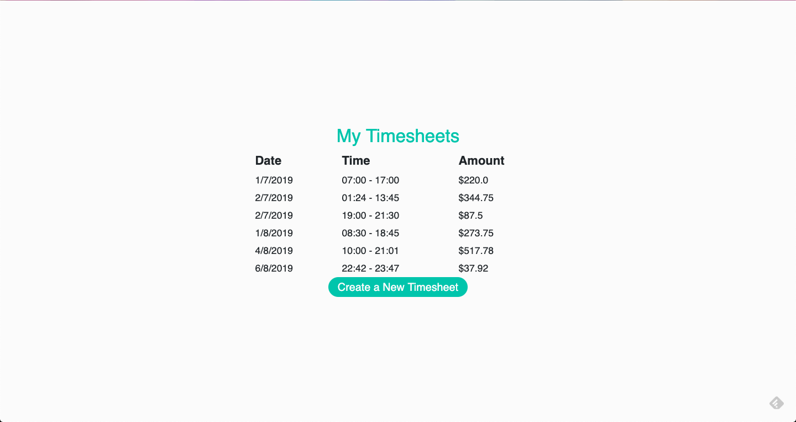
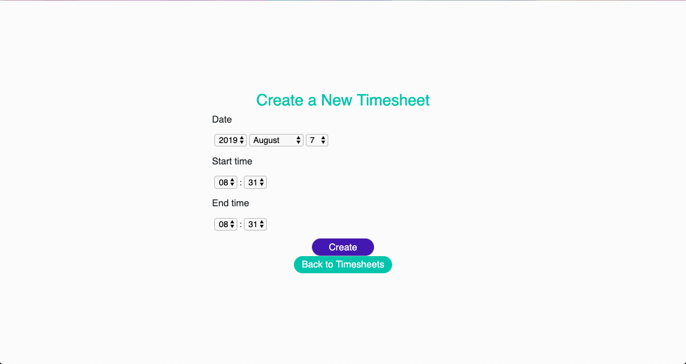

# Timesheets - 2019 Weploy Coding Test


## About
This is my attempt at Weploy's 2019 backend technical coding challenge. 

## Setup

To download this application to your computer, navigate to the directory you want to use on your computer and run the following:
```
git clone https://github.com/JoshTeperman/weploy-timesheets.git
```
This should install the files locally. You can then run `cd weploy-timesheets` to open the application directory. 

Alternatively, you can download the code directly to your hard-drive: https://github.com/JoshTeperman/weploy-timesheets/archive/master.zip

To run this application, you will first need to have Ruby 2.6.0 installed on your machine. Installation instructions here: https://www.ruby-lang.org/en/documentation/installation/

You will also need Bundler installed:
```
gem install bundler
```
Once you have Ruby + Bundler installed, you can install the gem dependencies with this command:
```
bundle install
```

Once the gems are installed you need to set up the local database on your machine. Run these three commands:
```
rails db:create
rails db:migrate
rails db:seed
``` 
Once you've done that you should be able to run `rails s` to start the local server and visit http://localhost:3000/ to view a live version of the application.

To run the test suite and see if anything is failing run `bundle exec rspec` and you should see every test and a summary of the results of the tests. 

To view a test-coverage summary of the coverage of the tests you can run `open coverage/index.html` from console which will open a tab in your default browser and display test coverage information.

# App Description 
Timesheet management application built in Ruby on Rails. 

## Screenshots

>Home / Index View


>New Timesheet View


## Functionality (Front End): 
The front end of this application is very simple. A user visiting the webstie can only do two things:
- Create New Timesheets
- View Timesheets

Any errors from the backend are displayed as flash messages that the user can click to close.

Successfully creating a Timesheet redirects the user to the index page where they see a success flash message.

## Functionality (Back End): 
The backend creates new Timesheets and serves Timesheet data to the frontend in response to HTTP requests.

New Timesheets are validated using Rails hard parameters and additional custom validation functions. The code confirms that timesheets:
- contain each of the required attributes 'date', 'start_time', 'end_time'
- don't overlap
- are in the past
- start time is before end time

Any errors raised by these validations are captured and sent to the front end so they can be seen by the user.

When a timesheet is created the salary amount is calculated dynamically down to the minute and added to the model before saving.

New salary schema can flexibly be created and assigned to specific days so that timesheet amounts are automatically calculated based on the day of the week, and whether or not the hours were normal hours, overtime hours, or both. 

### Tech Stack & Framework
Since the challenge specifically stated the application had to be written in Ruby the tech stack is Ruby, Embedded Ruby, HTML and CSS/SASS.

I decided to create a Rails application rather than using Sinatra or something else. While Rails provides a lot of additional funcionality unnecessary for this project, it provides a solid platform for adding more functionality later, enforces MVC separation of concerns, and also syncs quite well with a Postgres database. 

### Architecture 
I followed the Rails standard MVC Architecture. Modularized code separated into Models, Views and Controllers. 

>Front End
The front end Views are created using Embedded Ruby served with data from the backend and styled with CSS and very small amounts of SASS. 

>Back End
My app uses the default Rails server, with Rails Routes and Controllers handling the business logic and responding to HTTP requests. 
There is only one Model, `Timesheet`, which is defined in the Models directory, and Timesheet data is stored in a PostgresQL Database accessed using Active Record. 


### File Structure
>/app file structure:


# Decisions, Challenges & Solutions

## Assumptions:

- Timesheets always start and end on the same day.
- '7am - 7pm' is inclusive, therefore a Monday timesheet starting at 7:00am and finishing at 7:00pm will include both the 7:00am minute and teh 7:00pm minute at the minimum rate
- There is never more than two hourly rates in a day - one base rate, and one (optional) premium rate.
- Time Zones are set to Melbourne for the purposes of this app.
- The server will always be available, as will the internet connecction.
- The New Timesheet Form will always result in a POST request that attempts to create a model with the expected datatypes, except in cases where a field may be left blank.
- A user is authorized to view any endpoint and access any controller method.


## Coding style 

I wrote this code with the assumption that the project would be extended, and someone should be able to read the code and understand what it does without needing to refer to documentation. To achieve this, I tried to follow the principles of good software development:
- I used TDD methodology (red, orange, green) for about 70% of the project. I find this style very useful when creating features & functionality for classes and models, and helped me to identify and solve several bugs I didn't realised I had introduced until I wrote the tests that found them - Always a great feeling!
- Descriptive variable and function naming (sometimes at the expense of Rubocop violations for reaching the line character limit 🤷‍). For this project I had difficulty solving all the Rubocop violations for line length and methods with too many branches. Typically these are a sign of code that can be improved, but in this case I felt that long method names were helpful in making the code easier to read, as I was struggling to think of variable names for all the different types of rates and the methods & variables that mutate them. I felt it was better in the end to be very descriptive.
- DRY 
- Methods should do only one thing, where possible - I attempted to extract individual pieces of logic into smaller methods
- Appropriate use of classes and modules to create an extra layer of logic and not let controllers / models get to 'heavy'
- Separation of concerns
- Providing a comprehensive testing suite to aid both refactoring and any additional extension to the codebase. Also to help describe the purpose of the code. 

## Key Challenges & Decisions

## Amount Calculation
The Calculate Amount method needed to take a Timesheet and figure out how much salary had been earned for that particular time period. A Timesheet has a start time and and end time, and there are rules for each day that determine the hourly rate. 

For example, the hourly rate on a Monday is $22/hour between 7am and 7pm, but $33 outside of that, so someone working 5am - 5pm on a Wednesday would get paid the base rate for 7am - 5pm, but the first two hours they would get the premium (overtime) rate. Mon, Wed, and Fri all have the same salary rate rules, but other days are different, so this code has to be able to determine what day it is, the rate schema for that day, etc etc. 

Solving Amount calculation took much longer than I thought it would, or should. I went through a couple of iterations of solutions until I found something I was happy with. 

I wanted to create code that:
- was extendable
- was performant
- was easy to understand
- was flexible

The reason this was challenging was the code had to not only calculate the amount itself, but also:

- understand what day the timesheet referred to
- select the appropriate daily rate schema for that day
- understand how much time was spent working during each particular rate for that day
- add all the separate amounts together to get one daily rate

Lastly, I wanted a mechanism that could be tweaked easily to allow for new schema to be introduced *on top of* the existing schema, allow for one-off events like public holidays etc to be introduced, and I wanted to avoid having to change variables in several different locations in the code whenever this happened.

It turns out creating a simple solution requires a lot more thinking than creating something complicated ... if that makes sense? 😅

### Attempt 1: Brute Force
My first idea was to just use control flow to calculate all the different possiibilities that went into this equation. This was a bad idea given the complexity, so I abandoned the brute force option pretty quickly. The pseudo code below demonstrates how awful this code would have been to read / write / manage:

>Pseudo code case statement 


>Pseudo code if/else statement 


### Attempt 2: Sets to the rescue!

What helped me was changing the way I was approaching the problem, and thinking about *time* in a different way. Instead of thinking of start-times and end times and counting hours and minutes, it occurred to me that I was actually looking for was this:


Sets and Intersection to the rescue! 🥳

>Calculating Amount - Sets

Taking the example I mentioned above, for someone working 5am to 5pm on a Monday:

- the timesheet starts at 5am and ends at 5pm
- the base rate for Monday starts at 7am and ends at 7pm
- the premium rate for Monday, which is any time outside of the base rate, therefore has two ranges: from 12:01am to 6:59am, and from 7:01pm to 11:59pm

when calculating the amount attribute of a timesheet, what I am actually calculating is when the timesheet overlaps with those three ranges, and how much they overlap.

In other words:

BASE RATE TIME = when timesheet overlaps with base rate time range\
PREMIUM RATE TIME = when timesheet overlaps with the two premium rate time range

In the language of Sets this can be written as:

BASE RATE TIME = the intersection of the timesheet set with the base rate set\
PREMIUM RATE TIME = the intersection of the timesheet set with the two premium rate sets

To simplify this further, instead of doing two separate calculations for premium time and adding them together, you can do this in one calculation using subtraction. We know that any timesheet time that is *not* base rate time must be premium time, therefore subtracting all of the base rate time from the timesheet should give us the remainder, which must be premium time by definition. 

In Sets, we can do this by finding the *difference* between two sets. Therefore:

PREMIUM RATE TIME = the difference between the Timesheet Set and Base Rate Set.

>Calculating Amount - seconds_since_midnight

The other piece of the puzzle was finding a way to actually do the calculation with Sets. In practise a Set is similar to an Array, and is created from a Range or Array of numbers. The Sets I would be working with were all ranges taken from a start time and and end time. Therefore it made sense to start thinking of time periods as ranges, or as consecutive units of time located somewhere between the Integer `0` (12:00am) and `n` (11:59pm), where `n` is the total number of seconds in 24 hours. Thinking this way would have a couple of very important benefits:
- Every second in a 24 hour period would refer to an exact point of Time during the day
- Since seconds are now numbers and ordered from smallest to largest, we can convert seconds into Ranges, Arrays, and Sets as necessary, and use the built-in Ruby Class methods to manipulate them
- We can now calculate exact amounts for a period of time down to the second

Now that I had a solution, I could attempt to create the logic that would parse the date into a day of the week, use the rules for hourly rates for that day, convert all of the ranges into sets, and then *hopefully* spit out the right `amount`.

>First Draft:


The first draft worked well, but once again I was running into the issue of having to use `if / else` blocks as control flow to check the weekday and apply the appropriate daily rates, and there was far too much happening in the `calculate_amount` method. If a method does more than one thing, the logic should be broken up to make it more readable, easier to debug, and easier to test, so I did a major refactor, but keeping the core idea the same.

The final version of my solution:
- breaks the `calculate_amount` method up into six methods
- uses a new `RateSchema` class to define different rating presets that are assigned to days of the week
- searches a hash of all the instances of `RateSchema` by the weekday of the new Timesheet to select the appropriate rules for the calculation, thereby avoiding the need for endless `if/else` control flow to perform this logic.
- extracts the constant SECONDS_IN_AN_HOUR so that it can be used anywhere in the code (also used in tests)

>Final Solution


>RateSchema Class


>Pros of this solution:
- More flexible
- Easier to extend
- Each bit of logic is extracted into its own method
- Better separation of concerns
- Using Sets gives us the useability of Arrays with the speed gains of hashes
- Assuming that `RateSchema` are tied to days of the week this works well. 

>Cons of this solution:
- Code is more abstract, may require explanation for anyone who is not me.
- I'm uncertain whether there is a performance cost for converting Time multiple times during the equation (Time > Range > Set etc) that would cancel out the performance benefits of using Sets.
- Rate class with base_rate and overtime_rate works fairly well for base/overtime pairs, but would need to be reconfigured should there be more than two rates for a given day.

# Testing
I decided to use Rspec with rails-controller-testing and spent some additional time learning to use Factory Bot to make life easier and reduce code repetition. I also installed simplecov to analyse test converage.

There are currently 38 tests, all passing. Test coverage is 85% which I'm very comfortable with as my application_helper.rb score of 30% is what's bringing the number down and that's just a bit of code that spits out flash messages using bootstrap.  

> Test Suite


> Test Coverage


### Testing Takeaways / Decisions

I wrote quite a lot of tests for Timesheet model validation and the logic used to calculate timesheet amount, just as I was pretty worried that calculation would failr for timesheets with unusual start-times and end-times, and calculations that had to consider multiple hourly rates. 

I wasn't sure how far I should go using FactoryBot and let(:) blocks to mock resources and variables in my tests. I chose to use FactoryBot to mock timesheets because it made it much easier to create instances of Time and Date classes and I could remove a lot of repeated code. 

To test the logic used to calculate timesheet amounts however, I had the option of simply using the RateSchema Class instances predefined in my code. However I chose not to do so and hard coded those calculations to determine what the expected total should be and compared that with the timesheet.amount attribute generated by my code. 

There were two reasons I chose this strategy. The first most important reason was that the logic itself is all private methods that are triggered with a :before_create hook, so difficult to reach with tests. The other reason was that I was concerned that pulling the same classes directly from the code I wanted to test would also risk pulling any bugs into my tests and not make the tests fail. I wanted to test the *result* of my code, ie: the amount itself, rather than how the amount is calculated. I wanted to test let my actual code produce results that I could test. I thought this would help me test the code itself rather than risk false positives from errors being replicated in my tests. However at the same time It led to a lot of additional repeated code, and changing constants like RateSchema instances would require a lot of changes in my tests as well. 

The downside of this strategy is that any test will have to be completely rewritten if the RateSchema themselves change. There is also a greater chance of human error in writing the calculations in the tests that calculate the expected answer, particularly as some of the calculations can get complicated. 
>For example this test:


This is clearly not ideal, and I'm sure there must be better ways to do this while minimizing the chance for error.

# Extending the Application

>Tests
- more details tests for the views, ensuring they render correctly, ensuring timesheets are added when a new one is created
- testing some more of the unhappy paths - particularly error handling and displaying flash messages 
>Functionality
- CRUD functionality - edit, upload, delete, show (single timesheet)
- user login and authentiction, users sessions and possibly cookies: would probably go with Devise and cancan or something similar
- make forma data persist when model validations fail and throw an errow so users don't have to resubmit their data
- client-side rendering (eg with React) to update the views without refreshing the entire page
- allow for overlapping days (should be able to start at 11pm and finish at 1am the next day, for example)
- allow users to select their timezone
- error handling for things like the server or internet not being available
>Other
- Rubocop: was surprised to find that default Rails scaffolded files throw a bunch of Rubocop offenses - I need to learn how to configure Rubocop work with Rails

# About the author

I'm Josh. Here are some of my things:

[Github](https://github.com/JoshTeperman_)

[Twitter](https://twitter.com/joshteperman)

https://www.josht.dev/

www.joshteperman.com (under construction)